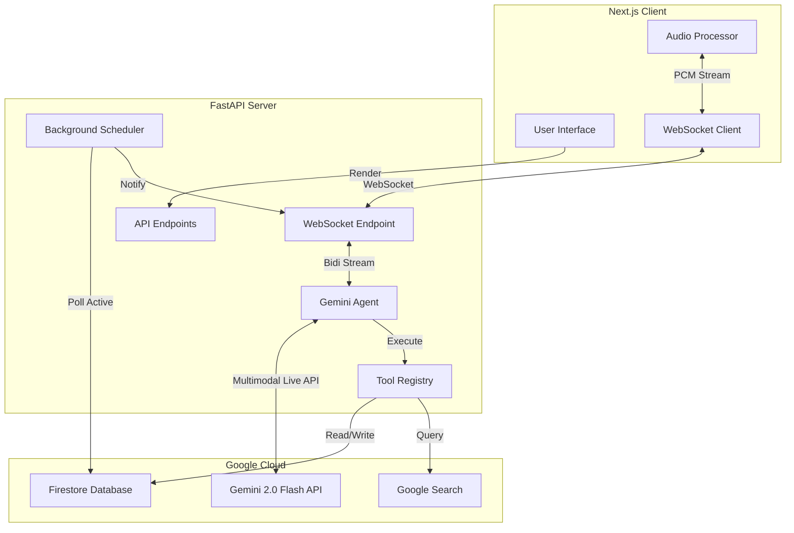

# AI Voice Assistant Demo 🎙️

A real-time, voice-controlled AI assistant built with **Google Gemini 2.0 Flash (Multimodal Live API)**, **FastAPI**, and **Next.js**.

The assistant supports natural conversation, dynamic memory, alarm/timer management, and timezone-aware scheduling.

## 🏗️ Architecture



## ✨ Features

- **🗣️ Natural Voice Interaction**: Low-latency bidirectional audio streaming with Gemini 2.0.
- **🧠 Dynamic Memory**: Remembers arbitrary facts (e.g., "My Wi-Fi password is...").
- **🌍 Timezone Awareness**: Automatically infers and respects your local time for scheduling.
- **⏰ Alarms & Timers**: Create, list, stop, and delete alarms/timers with natural language.
- **🌐 Web Search**: Can search Google for real-time information.
- **👤 User Profile**: Persists name, city, gender, and personal preferences in Firestore.
- **🛡️ Private**: Explicitly authorized to store personal convenience data.

## ☁️ Live Demo

| Service | URL |
| :--- | :--- |
| **Frontend** | [https://assistant-frontend-1047514462039.us-west1.run.app](https://assistant-frontend-1047514462039.us-west1.run.app) |
| **Backend** | [https://assistant-demo-1047514462039.us-west1.run.app](https://assistant-demo-1047514462039.us-west1.run.app) |

## 🚀 Getting Started

### Prerequisites
- Python 3.9+
- Node.js 18+
- [Google Gemini API Key](https://aistudio.google.com/)
- Google Cloud Project with **Firestore** enabled.

### Backend Setup

```bash
cd backend
python -m venv venv
source venv/bin/activate  # Windows: venv\Scripts\activate
pip install -r requirements.txt

# Create .env file
echo "GEMINI_API_KEY=your_key_here" > .env

# Authenticate with Google Cloud (for Firestore)
gcloud auth application-default login

# Run Server
uvicorn main:app --reload
```
*Server runs on `http://localhost:8000`*

### Frontend Setup

```bash
cd frontend
npm install

# Run Client
npm run dev
```
*App runs on `http://localhost:3000`*

## 🛠️ Tech Stack

- **Backend**: Python, FastAPI, Google Cloud Firestore
- **Frontend**: TypeScript, Next.js 14, Tailwind CSS, Shadcn UI
- **AI**: Google Gemini 2.0 Flash (Multimodal Live API)
- **Audio**: Raw PCM 16-bit streaming (24kHz)
